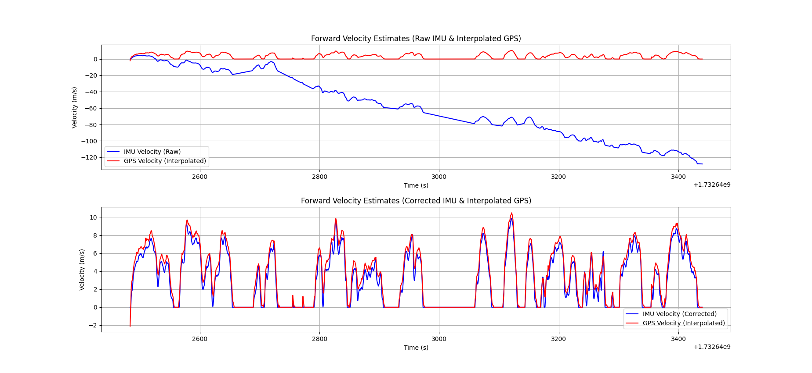
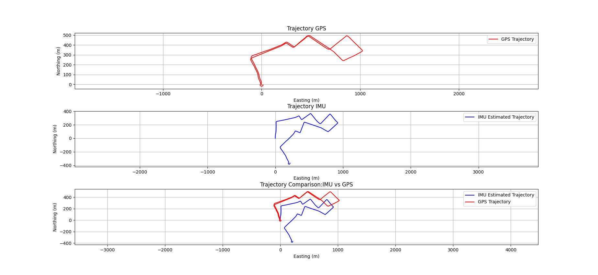

# Dead-Reckoning
This is an Dead Reckoning project based on the Data collected from the NUANCE Car using IMU and GPS

---
## The File Structure

### dead-reckoning/src/analysis
This folder contains the code for the analysis of the IMU data.
### dead-reckoning/src/analysis/output
This folder contains the output files of the analysis.
### dead-reckoning/src/Report and Analysis
This folder contains the report and analysis of the assignment.
### dead-reckoning/src/data
This folder contains the ROS bag file of the imu data and gps data published as ros topic imu and gps.
### dead-reckoning/src/dead-reckoning/launch
This folder contains the launch file for the assignment.

---

### Results

Forward Velocity Estimates:



GPS and IMU Trajectory Comparison:



For more detailed analysis refer to [Analysis Report](analysis/analysis%20and%20report/Report.pdf)


Refer to GPS and IMU package readme files for using GPS and IMU Driver

[GPS Readme](https://github.com/kamalnath26/GPS-Driver/blob/main/README.md)

[IMU Readme](https://github.com/kamalnath26/IMU-Driver/blob/main/README.md)

### Running the Code to launch the ROS node to publish the imu and gps data

```bash
roslaunch dead-reckoning standlone_driver.launch
```
This will launch the ROS node to publish the imu and gps data. By deafult this launch file takes /dev/ttyUSB0 for gps and /dev/ttyUSB1 for imu. You can change the port by modifying the launch file or by passing the port as an argument to the launch file.

"*" is any number from 0 to 9

```bash
roslaunch dead-reckoning standlone_driver.launch gps_port:=/dev/ttyUSB* imu_port:=/dev/ttyUSB*
```

or you can also separately launch the gps and imu nodes as mentioned in previous labs readme files.

---

### Running the analysis scripts

#### Dependencies to run the analysis scripts

```bash
sudo pip3 install scikit-learn geopy
```

To run the analysis scripts, navigate to the `analysis` folder and run the following commands:

#### One the terminal from the analysis folder and run all the analysis scripts

To run the entire imu analysis

```bash
python3 analysis.py
```

---